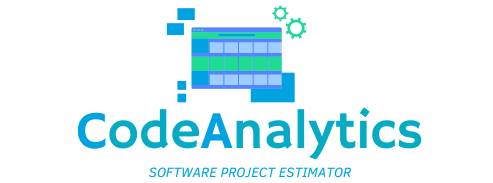

# CodeAnalytics

CodeAnalytics is an AI-powered tool designed to estimate the duration and costs of software projects based on various input parameters. Leveraging machine learning models, the software provides accurate predictions using Adjusted Function Points (AFP) methodology. This approach helps project managers and developers gain insights into resource planning and budgeting, allowing for more effective and efficient project execution.
<p align="center">
  
</p>


## Server execution on local machine

To set up the project on your local machine, follow these steps:

1. **Clone the repository**:

   ```
   git clone https://github.com/mattiatritto/CodeAnalytics.git
   ```
   
   
2. **Navigate to the report service directory**:

   ```
   cd CodeAnalytics/report
   ```

3. **Build the report service Docker image**:

   ```
   sudo docker build -t report-service .
   ```

4. **Run the report service Docker container**:

   ```
   docker run -d -p 9000:9000 --name report-service report-service
   ```
   
5. **Navigate to the backend service directory**:

   ```
   cd CodeAnalytics/backend
   ```

6. **Build the backend service Docker image**:

   ```
   sudo docker build -t CodeAnalytics .
   ```

7. **Run the report service Docker container**: After building the Docker image, you can run the project by executing the following command:

   ```
   docker run -d -p 8080:8080 --name CodeAnalytics CodeAnalytics
   ```

## Server deployment on Google Cloud Platform

To deploy the server on Google Cloud Platform, follow these steps:

1. **Install Google Cloud CLI**:
   Install the `gcloud` CLI by following the instructions at the [official documentation](https://cloud.google.com/sdk/docs/install).

2. **Create a new Google Cloud project**:
   Go to the [Google Cloud Console](https://console.cloud.google.com/) and create a new project, named codeanalytics.

3. **Enable required services**:
   Enable the following APIs and services in your project:
   
   - `Artifact Registry API`
   - `Cloud Build`
   - `Cloud Deploy`

   You can do this by searching for these services in the Google Cloud Console and enabling them.

4. **Authenticate with Google Cloud**:
   Log in to your Google Cloud account using the `gcloud` CLI:

   ```
   gcloud auth login
   ```
   
5. **Set the project in your gcloud CLI**:
   Set your project as the active one by running:

   ```
   gcloud config set project codeanalytics
   ```

6. **Create an Artifact Registry**:
   Create a new Docker repository in the Artifact Registry to store the report-service docker image:

   ```
   gcloud artifacts repositories create report-service \
    --repository-format=docker \
    --location=us-central1 \
    --description="CodeAnalytics report-service"
   ```

7. **Build and submit the Docker image**: 
   Use Cloud Build to build and submit your report-service image to the Artifact Registry:

   ```
   gcloud builds submit --region=us-central1 \
   --tag us-central1-docker.pkg.dev/codeanalytics/report-service/report-service-image:tag1
   ```

8. **Deploy the Docker image to Cloud Run**: 
   Deploy the Docker image to Cloud Run, which will host the report-service:

   ```
    gcloud run deploy --image=us-central1-docker.pkg.dev/codeanalytics/report-service/report-service-image:tag1
   ```

9. **Verify the deployment**: 
   Once deployed, you can check if the service is running by accessing the URL provided by GCP.

10. **Create a new Artifact Registry**:
   Create a new Docker repository in the Artifact Registry to store the codeanalytics-backend docker image:

      ```
      gcloud artifacts repositories create codeanalytics-backend \
       --repository-format=docker \
       --location=us-central1 \
       --description="CodeAnalytics backend"
      ```

11. **Build and submit the Docker image**: 
   Use Cloud Build to build and submit your codeanalytics-backend image to the Artifact Registry:

      ```
      gcloud builds submit --region=us-central1 \
      --tag us-central1-docker.pkg.dev/codeanalytics/codeanalytics-backend/codeanalytics-backend-image:tag1
      ```
   
12. **Deploy the Docker image to Cloud Run**: 
   Deploy the Docker image to Cloud Run, which will host the codeanalytics-backend:
   
      ```
      gcloud run deploy --image=us-central1-docker.pkg.dev/codeanalytics/codeanalytics-backend/codeanalytics-backend-image:tag1
      ```

13. **Verify the deployment**: 
   Once deployed, you can check if the service is running by accessing the URL provided by GCP.


## Frontend deployment provided by Streamlit Public Cloud

The frontend of this project is hosted on [Streamlit Cloud Public](https://streamlit.io/cloud). To deploy it, simply connect to your personal Streamlit profile and link the GitHub repository containing the frontend code written in Streamlit. This setup allows users to access the application directly from their browser, eliminating the need for local setup.

For more information on connecting your repository, refer to the [Streamlit deployment guide](https://docs.streamlit.io/deploy).


## Software Architecture Overview

1. **Frontend (Streamlit)**
   - Users interact with the application through a web interface built using Streamlit.
   - The frontend (hosted on Streamlit Public Cloud) sends requests to the backend (hosted on Google Cloud Platform) to generate reports or obtain predictions from the Machine Learning model.

2. **Backend Service (Exposed to the Public) (FastAPI)**
   - The backend is built using FastAPI, which handles requests from the frontend.
   - It interacts with the Machine Learning model to make predictions.
   - The backend provides various endpoints for functionalities such as sending data for predictions, retrieving past data for analytics, and generating reports.

3. **Report Service (Private, Non-Public)**
   - The report service is a separate component within the same private network as the backend.
   - This service is not exposed to the public and communicates only with the backend.
   - It generates reports based on various parameters of the software.

4. **Containerization (Docker)**
   - The backend, the report service and the Streamlit frontend are containerized using Docker.
   - Containerization ensures consistent application behavior across different environments.

5. **Cloud Deployment**
   - The entire application is deployed in the cloud using services like Google Cloud Platform (GCP) and Streamlit Public Cloud.
   - This setup allows for scalability, reliability, and secure access to both the public-facing backend and the internal report service.